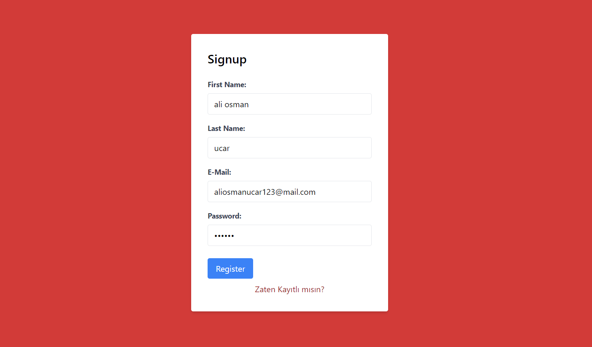
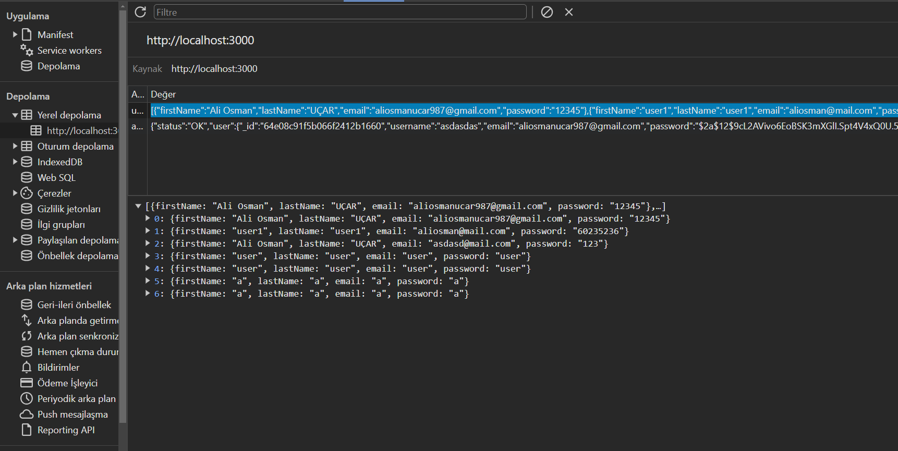
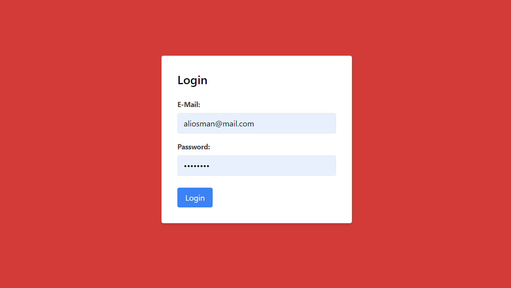
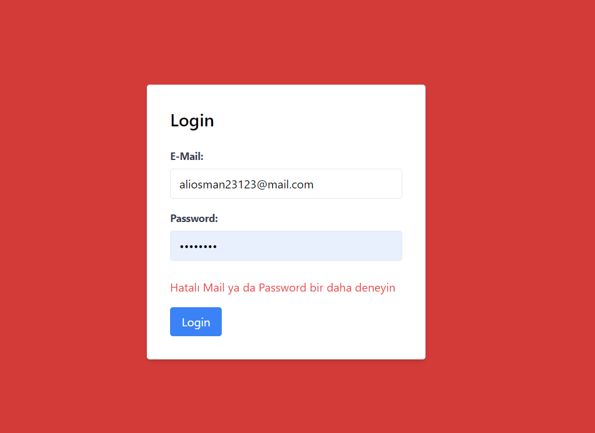
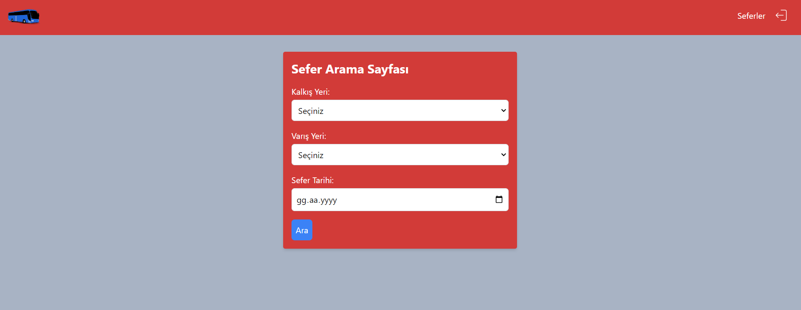
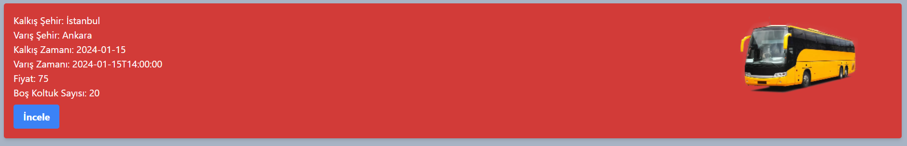
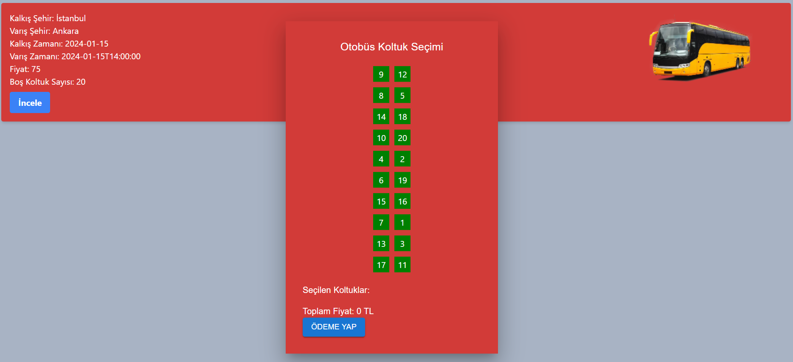
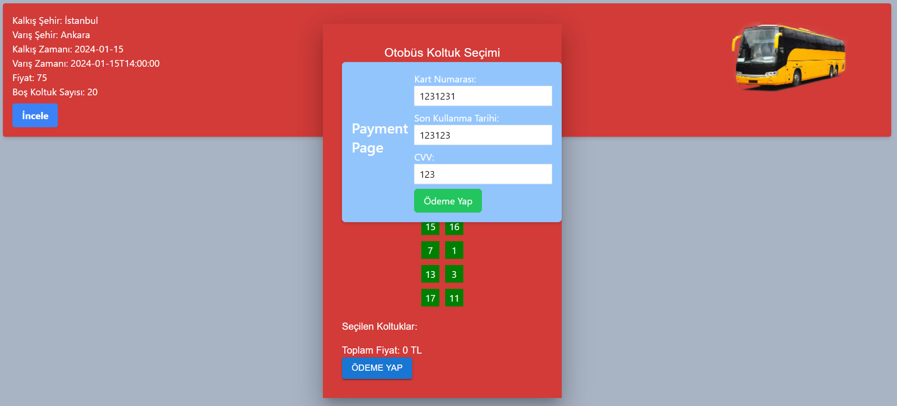
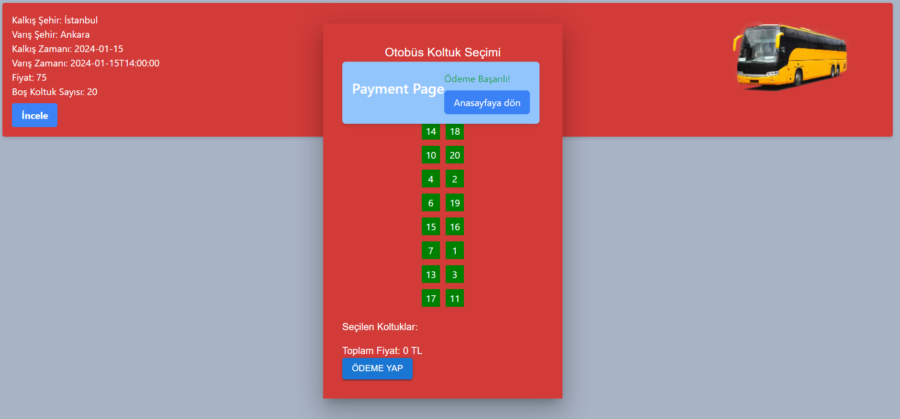
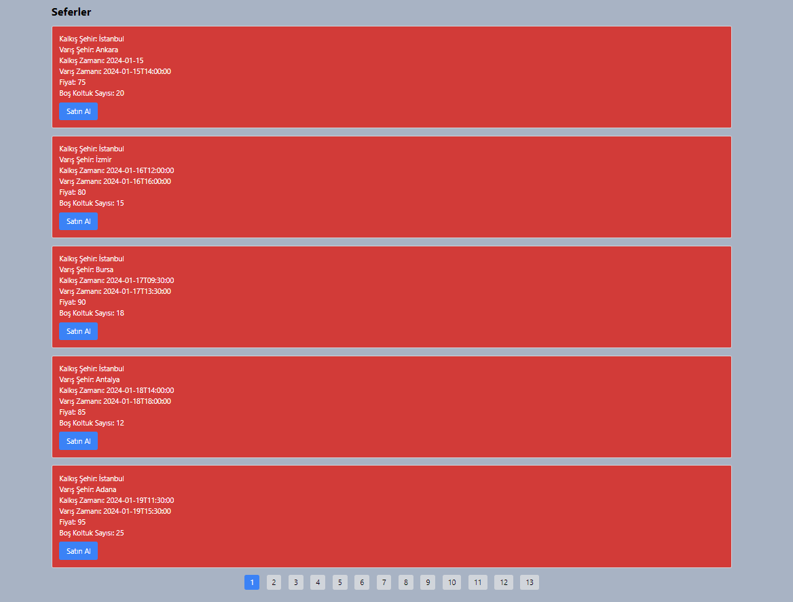

Buss Ticket

Bu proje, React ve TypeScript kullanılarak geliştirilmiş bir web uygulamasıdır. Proje, ayrıca React Router, Tailwind CSS, Material-UI, static JSON verilerini kullanmaktadır.

Projeyi yerel makinenizde çalıştırmak için aşağıdaki adımları izleyin.

Gereksinimler
Projeyi çalıştırmak için bilgisayarınızda Node.js'in yüklü olması gerekmektedir.

Kurulum
Bu depoyu yerel makinenize klonlayın:

bash
Copy code
git clone https://github.com/minervain/lojiper-task.git
cd lojiper-task

Bağımlılıkları yükleyin:
bash
Copy code
npm install

Çalıştırma
Projeyi başlatmak için aşağıdaki komutu kullanın:

bash
Copy code
npm start

Kullanılan Teknolojiler

React
TypeScript
React Router
Tailwind CSS
Material-UI

<h3>Kayıt ekranı </h3>

<h3>Local Storage Kaydedildi user bilgileri </h3>

<h3>Giriş Ekranı </h3>

<h3>Hatalı Giriş Ekranı </h3>

<h3>Select Page</h3>

<h3>Inquiry Page </h3>

<h3>Seatle Select</h3>

<h3>Payment </h3>

<h3>Payment Succes </h3>

<h3>Seferler </h3>

